### 👋 🌎 Hello, world!
<!--
###   **Hello world!**
-->

<!-- *"Only half of programming is coding. The other 90% is debugging"* 
&nbsp; &nbsp; &nbsp; Anonymous -->

<!-- *"There are only 10 types of people in this world: those who understand binary, and those who don't"* 
&nbsp; &nbsp; &nbsp; Ian Stewart -->

<!-- Any fool can write code that a computer can understand. Good programmers write code that humans can understand. ― Martin Fowler -->

<!-- If, at first, you do not succeed, call it version 1.0. ― Khayri R.R. Woulfe -->

  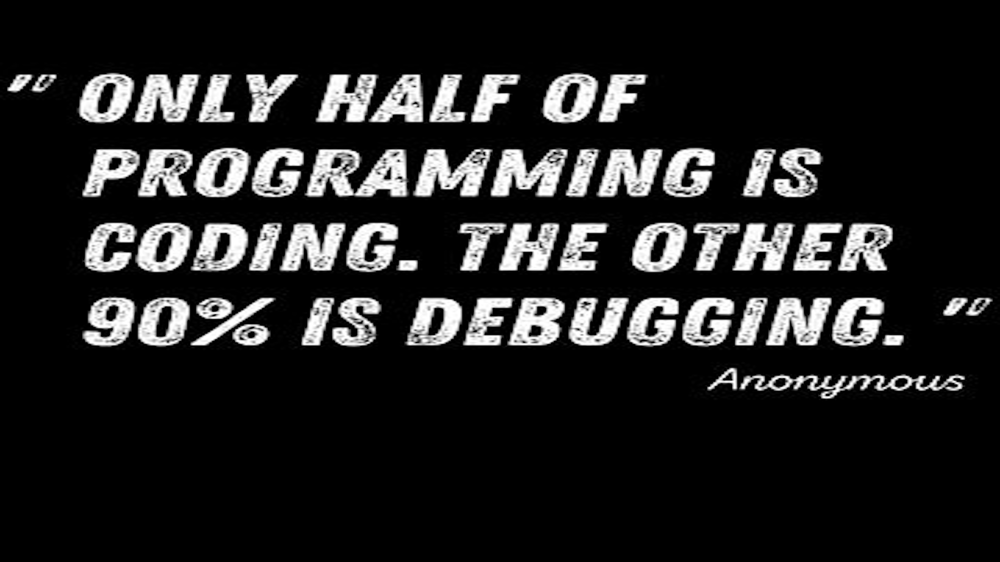
  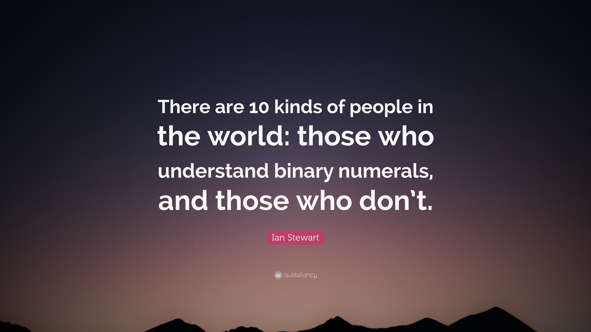
  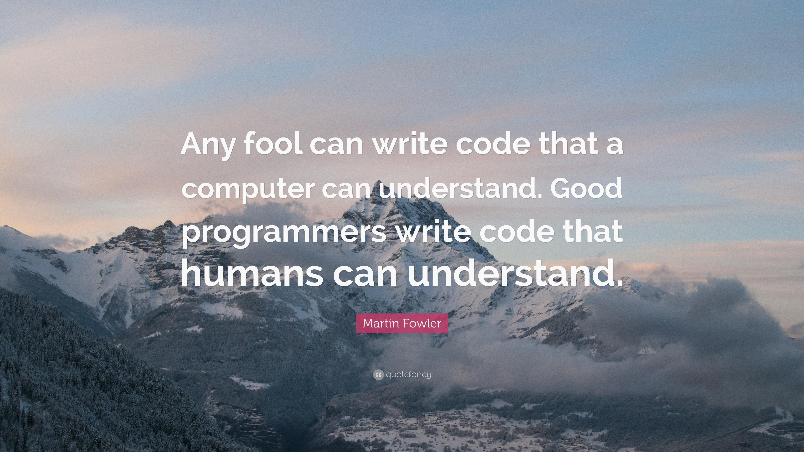
  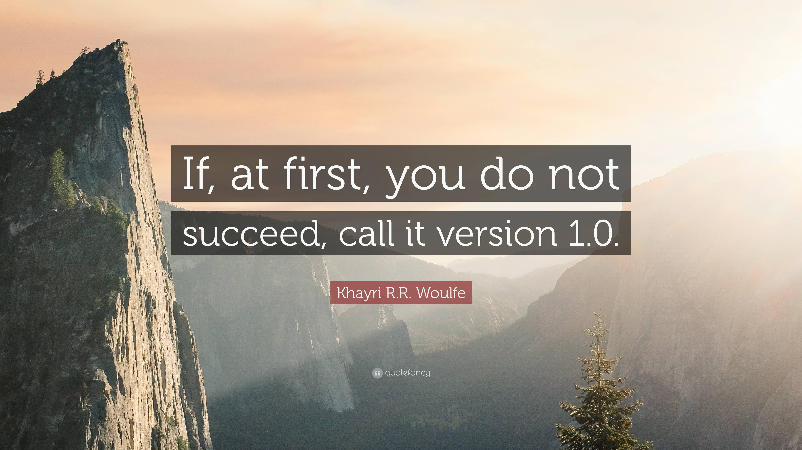
  

### 🚀 Confira meus outros projetos!

### ✨ 1 - Destaques ✨

<table>
  <tr align="center">
    <td width="33%">
    </td>
    <td width="33%">
      
       
      <a href="https://github.com/Alessandro1918/aleFM">
        Ale FM
      </a>
       
      Uma rádio web tocando minhas músicas preferidas, 24h por dia!
    </td>
    <td width="33%">
    </td>
  </tr>
  <tr align="center">
    <td>
      
      <a href="https://github.com/Alessandro1918/cnv_neural_network_pokemon">
        CNV Neural Net Pokemon
      </a>
       
      A Neural Network used for Image Classification and Computer Vision... of Pokemon!
    </td>
    <td>
      
      <a href="https://github.com/Alessandro1918/pokedex-ar">
        Pokedex AR
      </a>
       
      Um app identificador de imagens de Pokemon! Tire uma foto e descubra mais sobre seu Pokemon preferido!
    </td>
    <td>
      
      <a href="https://github.com/Alessandro1918/pokedex-ar-web">
        Pokedex AR Web
      </a>
       
      Versão web do app Pokedex-AR
    </td>
  </tr>
</table>
 

### 🖼️ 2 - Sites web

<table>
  <tr align="center">
    <td width="33%">
      <a href="https://github.com/Alessandro1918/transformarti">
        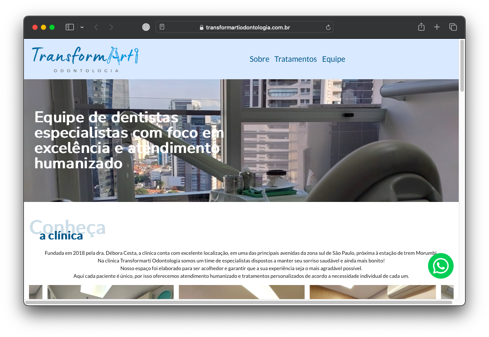
      </a>
      <a href="https://github.com/Alessandro1918/transformarti">
        Transformarti
      </a>
       
      Landing page da Clínica Odontológica Transformarti
    </td>
    <td width="33%">
      <a href="https://github.com/Alessandro1918/wisteria">
        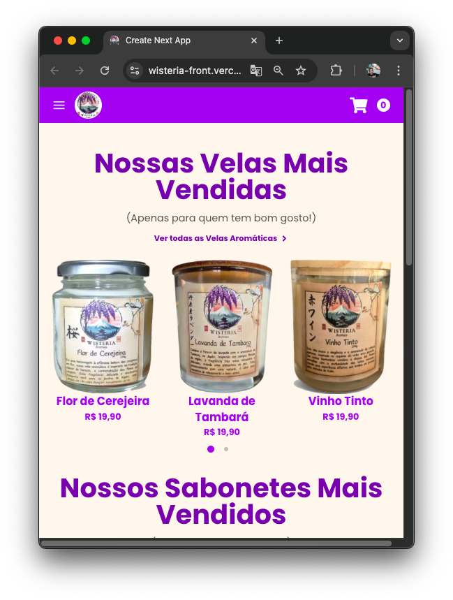
      </a>
      <a href="https://github.com/Alessandro1918/wisteria">
        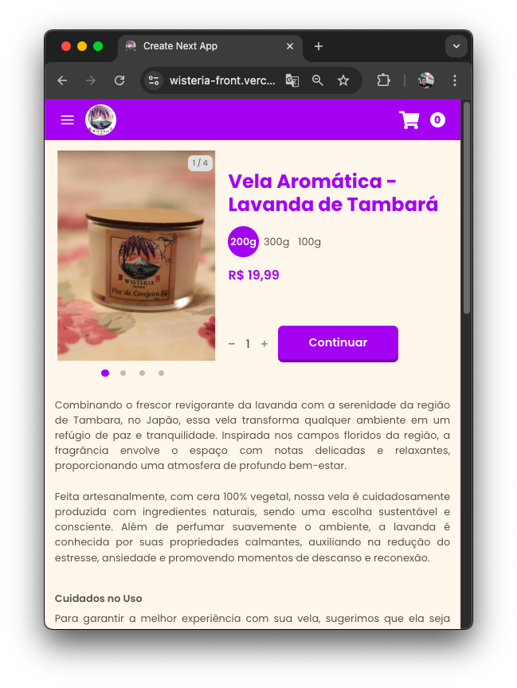
      </a>
      <a href="https://github.com/Alessandro1918/wisteria">
        Wisteria
      </a>
       
      Webpage da loja de produtos artesanais Wisteria
    </td>
    <td width="33%">
      
      
      <a href="https://github.com/Alessandro1918/nlw-pocket-js">
        In.Orbit
      </a>
       
      Um site (backend / frontend) para acompanhar tarefas e objetivos.
    </td>
  </tr>
  <tr align="center">
    <td>
      
      <a href="https://github.com/Alessandro1918/Setup-NLW-08">
        Setup-NLW-08
      </a>
       
      Um controlador de hábitos com visualização do progresso dia-a-dia
    </td>
    <td>
      
      <a href="https://github.com/Alessandro1918/Chat-NLW-05">
        Chat-NLW-05
      </a>
       
      Implementação de um web chat para comunicação online!
    </td>
    <td>
      
      <a href="https://github.com/Alessandro1918/Move.it-NLW-04">
        Move.it-NLW-04
      </a>
       
      Aumente sua produtividade, melhore sua saúde, ganhe pontos e suba de nível!
    </td>
  </tr>
  <tr align="center">
    <td>
      
      <a href="https://github.com/Alessandro1918/Happy-NLW-03">
        Happy-NLW-03
      </a>
       
      O Happy é um projeto que visa facilitar visitas aos orfanatos próximos a você!
    </td>
    <td>
      
      <a href="https://github.com/Alessandro1918/Proffy-NLW-02">
        Proffy-NLW-02
      </a>
       
      O Proffy é uma plataforma de estudos online que ajuda pessoas a encontrarem professores online.
    </td>
  </tr>
</table>
 

### 📊 3 - Backend

<table>
  <tr align="center">
    <td width="33%">
      
      <a href="https://github.com/Alessandro1918/swagger-api">
        Swagger API
      </a>
       
      Um exemplo de documentação de rotas de API com Swagger
    </td>
    <td width="33%">
      
      <a href="https://github.com/Alessandro1918/dockers">
        Dockers
      </a>
       
      Exemplos de projetos rodando em containers Docker.
    </td>
    <td width="33%">
      
       
      <a href="https://github.com/Alessandro1918/radio-id">
        Radio ID
      </a>
       
      Uma API para identificar a música que está tocando agora em sua estação de rádio favorita!
    </td>
  </tr>
  <tr align="center">
    <td>
      
      <a href="https://github.com/Alessandro1918/node-email">
        Node Email
      </a>
       
      Envio de emails de um servidor Node.js
    </td>
    <td>
      <a href="https://github.com/Alessandro1918/ci">
        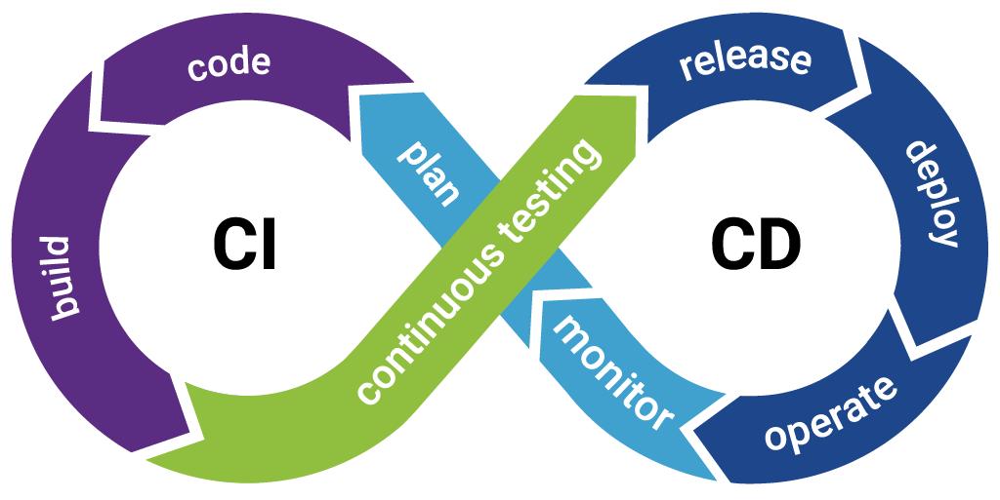
      </a>
       
      <a href="https://github.com/Alessandro1918/ci">
        CI
      </a>
       
      Integração contínua (CI) de um repositório GitHub para o DockerHub (Registro de Containers Docker). 
    </td>
    <td>
      
      <a href="https://github.com/Alessandro1918/google-sheets-db">
        Google Sheets Database
      </a>
       
      Protótipo de uma base de dados a partir de uma Planilha Google.
    </td>
  </tr>
  <tr align="center">
    <td>
      <a href="https://github.com/Alessandro1918/blogpostAPI">
        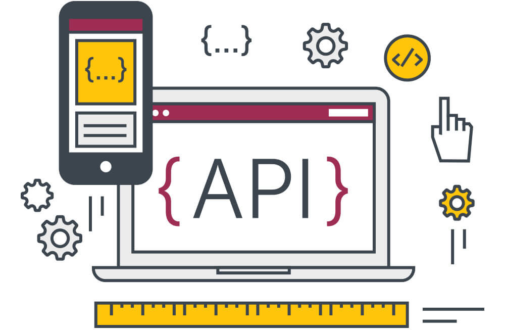
      </a>
      <a href="https://github.com/Alessandro1918/blogpostAPI">
        blogpostAPI
      </a>
       
      Um protótipo de API para salvar, ler, editar e deletar posts de diferentes autores em um blog
    </td>
  </tr>
</table>
 

### ❓ 4 - Miscelânia

<table>
  <tr align="center">
    <td width="33%">
      
      <a href="https://github.com/Alessandro1918/google-maps-api">
        Google Maps API
      </a>
       
      Visualize dados geográficos em gráficos de mapas, encontre relações de modo mais fácil, e tenha insights melhores! 
    </td>
    <td width="33%">
      
      <a href="https://github.com/Alessandro1918/video-chat-front">
        Videochat
      </a>
       
      Uma sala de videochat autônoma, sem bibliotecas de terceiros!
    </td>
    <td width="33%">
      
      <a href="https://github.com/Alessandro1918/who-am-i">
        Who Am I?
      </a>
       
      Obtenha informações sobre usuários do seu site e trace um perfil do seu público-alvo.
    </td>
  </tr>
  <tr align="center">
    <td>
      
       
      <a href="https://github.com/Alessandro1918/mobile-push-notifications">
        Mobile Push Notifications
      </a>
       
      Um projeto minimalista para o envio de notificações para aplicativos de celular usando a plataforma Expo
    </td>
    <td>
      
       
      <a href="https://github.com/Alessandro1918/automate-form">
        Automate PC Web
      </a>
       
      Automatize tarefas repetitivas com scripts que controlam seu mouse e teclado!
    </td>
    <td>
      
       
      <a href="https://github.com/Alessandro1918/pokemon-tcg-mosaic">
        Pokemon TCG Mosaic
      </a>
       
      Um mosaico de uma carta de Pokemon, usando outras cartas de Pokemon!
    </td>
  </tr>
  <tr align="center">
    <td>
      
      <a href="https://github.com/Alessandro1918/pokerAPI">
        pokerAPI
      </a>
       
      Rank poker hands! With this API, input some cards, and get a numeric value related to that hand's strength!
    </td>
  </tr>
</table>
 

### 🎮  5 - Games

<table>
  <tr align="center">
    <td width="33%">
      <a href="https://github.com/Alessandro1918/rubikSolver">
        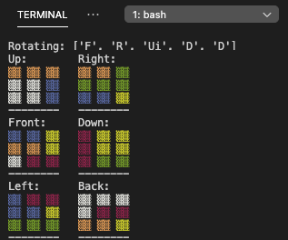
      </a>
      <a href="https://github.com/Alessandro1918/rubikSolver">
        rubikSolver
      </a>
       
      A Python script to solve a Rubik's Cube!
    </td>
    <td width="33%">
      <a href="https://github.com/Alessandro1918/sudokuSolver">
        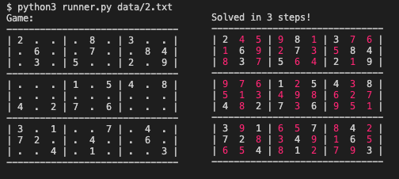
      </a>
      <a href="https://github.com/Alessandro1918/sudokuSolver">
        sudokuSolver
      </a>
       
      A Python script to solve Sudoku games!
    </td>
    <td width="33%">
      
      <a href="https://github.com/Alessandro1918/tictactoeAI">
        tictactoeAI
      </a>
       
      Test your Tic-Tac-Toe abilities against a computer!
    </td>
  </tr>
  <tr align="center">
    <td>
      
       
      <a href="https://github.com/Alessandro1918/tetris">
        Tetris
      </a>
       
      Um jogo de Tetris, usando um terminal CLI como interface gráfica.
    </td>
    <td>
      
      <a href="https://github.com/Alessandro1918/game-of-life">
        Conway's Game of Life
      </a>
       
      Uma simulação do "Jogo da Vida" (Conway's Game of Life) em um terminal CLI.
    </td>
    <td>
      
      <a href="https://github.com/Alessandro1918/minesweeper">
        Campo Minado
      </a>
       
      Uma releitura de Campo Minado, clássico jogo do Windows, agora em um terminal CLI.
    </td>
  </tr>
</table>
 

<!--
**Alessandro1918/Alessandro1918** is a ✨ _special_ ✨ repository because its `README.md` (this file) appears on your GitHub profile.

Here are some ideas to get you started:

- 🔭 I’m currently working on ...
- 🌱 I’m currently learning ...
- 👯 I’m looking to collaborate on ...
- 🤔 I’m looking for help with ...
- 💬 Ask me about ...
- 📫 How to reach me: ...
- 😄 Pronouns: ...
- ⚡ Fun fact: ...
-->
