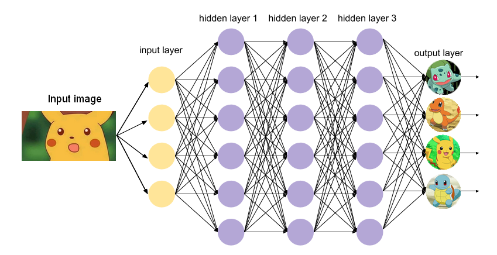
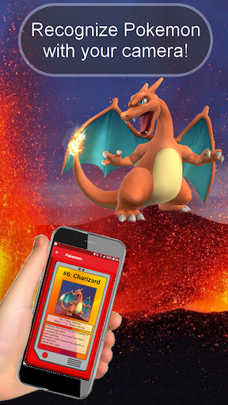
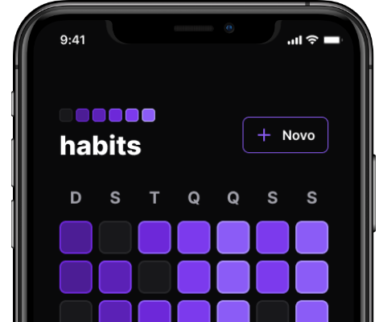
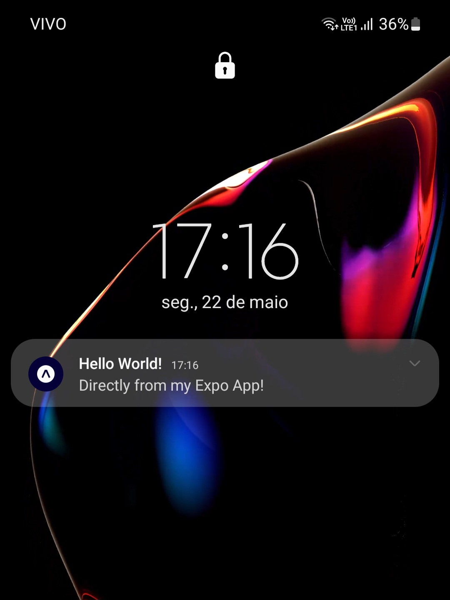
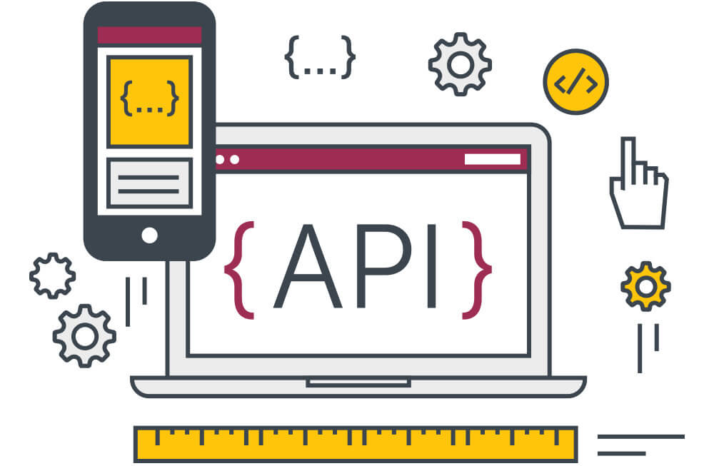
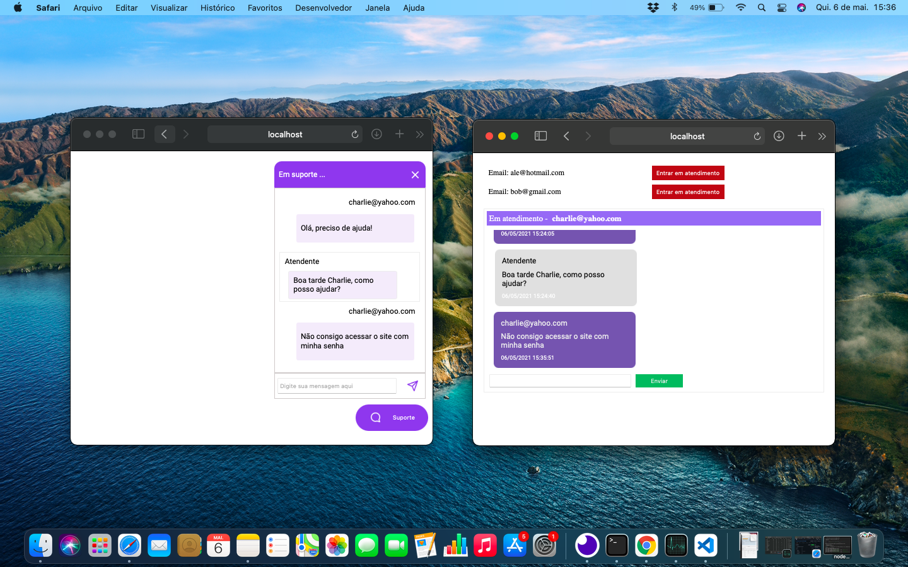
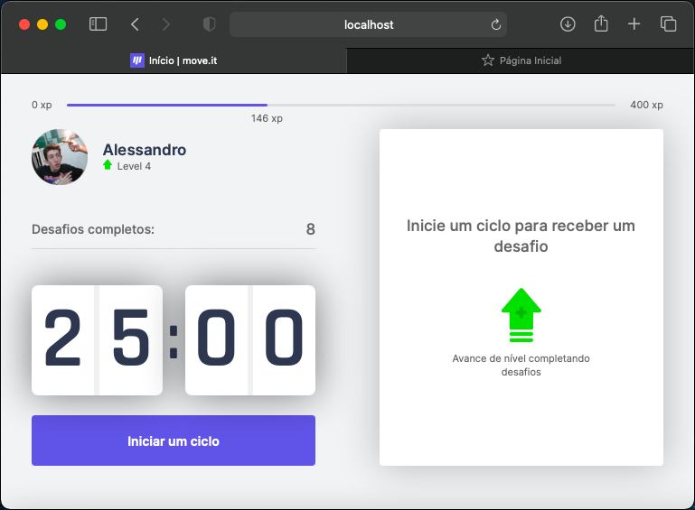
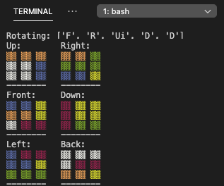
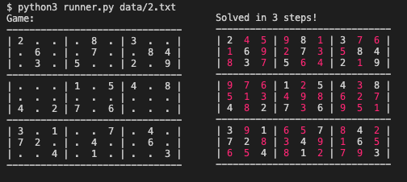
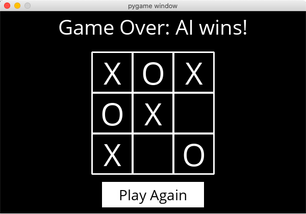

### 👋 🌎 Hello, world!
<!--
###   **Hello world!**
-->

*"Only half of programming is coding. The other 90% is debugging"* 
&nbsp; &nbsp; &nbsp; Anonymous

*"There are only 10 types of people in this world: those who understand binary, and those who don't"* 
&nbsp; &nbsp; &nbsp; Ian Stewart

<!-- Any fool can write code that a computer can understand. Good programmers write code that humans can understand. ― Martin Fowler -->

<!-- If, at first, you do not succeed, call it version 1.0. ― Khayri R.R. Woulfe -->

### Confira meus outros projetos!

<table>
  <!-- 
    .
    ROW 1:
    .
  -->
  <tr align="center">
    <td width="33%">
      
      <a href="https://github.com/Alessandro1918/cnv_neural_network_pokemon">
        CNV Neural Net Pokemon
      </a>
        A Neural Network used for Image Classification and Computer Vision. How can we balance all the technical terms, specifications and architectural decisions to make this problem more interesting? With Pokemon!
    </td>
    <td width="33%">
       
      <a href="https://github.com/Alessandro1918/aleFM">
        Ale FM
      </a>
        Uma rádio web tocando minhas músicas preferidas, 24h por dia!
    </td>
    <td width="33%">
       
      <a href="https://github.com/Alessandro1918/swagger-api">
        Swagger API
      </a>
        Um exemplo de documentação de rotas de API com Swagger
    </td>
  </tr>
  <!-- 
    .
    ROW 2:
    .
  -->
  <tr align="center">
    <td>
       
      <a href="https://github.com/Alessandro1918/pokedex-ar">
          Pokedex AR
      </a>
        Um identificador de imagens de Pokemon! Tire uma foto e descubra mais sobre seu Pokemon preferido!
    </td>   
    <td>
       
      <a href="https://github.com/Alessandro1918/google-maps-api">
        Google Maps API
      </a>
        Visualize dados geográficos em gráficos de mapas, encontre relações de modo mais fácil, e tenha insights melhores! 
    </td> 
    <td>
       
      <a href="https://github.com/Alessandro1918/video-chat-front">
        Videochat
      </a>
        Uma sala de videochat autônoma, sem bibliotecas de terceiros!
    </td>
  </tr>
  <!-- 
    .
    ROW 3:
    .
  -->
  <tr align="center">
    <td>
       
      <a href="https://github.com/Alessandro1918/who-am-i">
        Who Am I?
      </a>
        Obtenha informações sobre usuários do seu site e trace um perfil do seu público-alvo.
    </td> 
    <td>
       
      <a href="https://github.com/Alessandro1918/Setup-NLW-08">
        Setup-NLW-08
      </a>
        Um controlador de hábitos com visualização do progresso dia-a-dia
    </td>
    <td>
       
      <a href="https://github.com/Alessandro1918/mobile-push-notifications">
        Mobile Push Notifications
      </a>
        Um projeto minimalista mostrando o funcionamento de envio de notificações para aplicativos de celular usando a plataforma Expo
    </td>
  </tr>
  <!-- 
    .
    ROW 4:
    .
  -->
  <tr align="center">
    <td>
       
      <a href="https://github.com/Alessandro1918/blogpostAPI">
        blogpostAPI
      </a>
        Um protótipo de API para salvar, ler, editar e deletar posts de diferentes autores em um blog
    </td>  
    <td>
       
      <a href="https://github.com/Alessandro1918/Chat-NLW-05">
        Chat-NLW-05
      </a>
        Implementação de um web chat para comunicação online!
    </td>
    <td>
       
      <a href="https://github.com/Alessandro1918/Move.it-NLW-04">
        Move.it-NLW-04
      </a>
        Aumente sua produtividade, melhore sua saúde, ganhe pontos e suba de nível!
    </td>
  </tr>
  <!-- 
    .
    ROW 5:
    .
  -->
  <tr align="center">
    <td>
       
      <a href="https://github.com/Alessandro1918/Happy-NLW-03">
        Happy-NLW-03
      </a> 
        O Happy é um projeto que visa facilitar visitas aos orfanatos próximos a você!
    </td>  
    <td>
       
      <a href="https://github.com/Alessandro1918/rubikSolver">
          rubikSolver
      </a>
        A python script to solve a Rubik's Cube!
    </td> 
    <td>
       
      <a href="https://github.com/Alessandro1918/sudokuSolver">
        sudokuSolver
      </a> 
        A Python script to solve Sudoku games!
    </td>
  </tr>
  <!-- 
    .
    ROW 6:
    .
  -->
  <tr align="center">
    <td>
       
      <a href="https://github.com/Alessandro1918/tictactoeAI">
        tictactoeAI
      </a> 
        Test your Tic-Tac-Toe abilities against a computer!
    </td>   
    <td>
       
      <a href="https://github.com/Alessandro1918/pokerAPI">
          pokerAPI
      </a> 
        Rank poker hands! With this API, input some cards, and get a numeric value related to that hand's strength!
    </td> 
    <td>
    </td>
  </tr>
</table>

<!--
**Alessandro1918/Alessandro1918** is a ✨ _special_ ✨ repository because its `README.md` (this file) appears on your GitHub profile.

Here are some ideas to get you started:

- 🔭 I’m currently working on ...
- 🌱 I’m currently learning ...
- 👯 I’m looking to collaborate on ...
- 🤔 I’m looking for help with ...
- 💬 Ask me about ...
- 📫 How to reach me: ...
- 😄 Pronouns: ...
- ⚡ Fun fact: ...
-->
